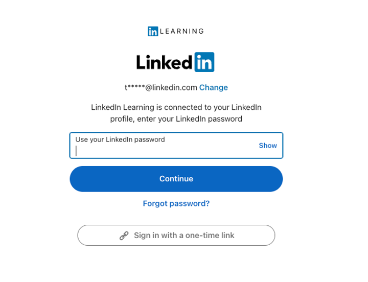

## General

**Q:** I’m ready to set up an integration, is there a LinkedIn Learning test environment?

**A:** No, LinkedIn Learning does not have a test environment. You can connect your LinkedIn Learning instance to a Test LMS environment if needed.

## Authentication

**Q:** I’ve set up SSO but am still being asked for a password! Is SSO not working?

**A:** If you chose to connect a personal LinkedIn.com profile you may be seeing a screen like this:

:::tip[Important]
This screen will display the email address of your personal LinkedIn.com account and is asking for your personal LinkedIn password, not your SSO password. You will see this screen every time you log out of LinkedIn.com or once every six months. Seeing this screen does not mean SSO isn’t working, it only shows up because you’ve connected a personal profile.
:::

**Q:** What are some of the benefits to connect my personal LinkedIn profile?

**A:** When you connect your LinkedIn profile to your LinkedIn Learning account, you will get personalized and
interactive learning experiences. Benefits to connecting your LinkedIn profile include:

* Share your learning achievements: Add Certificates of Completion and skills to your LinkedIn profile and
share LinkedIn Learning videos with your network.
* Watch courses with your connections and colleagues: See who else is learning with you and build
connections.
* Receive customized content recommendations: Get recommendations based on what your connections and
similar professionals are viewing, as well as recommendations based on your LinkedIn profile.
* Join learning groups: Deepen your learning by engaging other like-minded learners who have similar career
aspirations.
* Ask questions and get answers: Use Q&A to continue the conversation beyond the course with peers and
instructors.

**Q:** Where can I find some examples of how the login flow should work?

**A:** What type of login experience your users can expect depending on your authentication method. [Login Flows](https://training.talent.linkedin.com/page/linkedin-learning-customer-resources?q=login%20flow#language_english).

## Automated Content Sync

**Q:** My organization only has learners in specific countries. How do I limit which courses appear in my LMS based on language?

**A:** The answer to this will depend on your LMS. Reach out to your LMS representative to determine what options are available.

**Q:** How long will the content sync take? Is there a recommended time to kick it off?

**A:** The initial content sync can take up to 24 hours. If you are concerned about learner experience, we recommend starting the sync on a Friday and checking back on Monday to ensure it is completed.

**Q:** I’m missing some content! Why am I unable to find a video in my LMS?

**A:** Our Deep Integrations are course level only, so you may not be able to search for specific videos in your LMS. If you need to bring over specific videos, consider leveraging an AICC integration if supported by your LMS.

**Q:** Will the Deep Integration bring in Learning Paths?

**A:** No, deep integrations are course level only. If you would like to see a Learning Path in your LMS, consider leveraging an AICC integration if supported by your LMS.

**Q:** I don’t see my LMS listed in the documentation. Does that mean LinkedIn Learning can’t integrate with them?

**A:** If you do not see your LMS listed, we do not currently offer a Deep Integration with that LMS. You may be able to leverage AICC, we recommend checking with your LMS partner to ask if they are able to integrate via AICC.

## AICC Content Integration

**Q:** What is an AICC package and how do I download it?

**A:** AICC packages contain course metadata (course title, author, description, etc.) in a .zip file and can be downloaded in bulk for the entire LinkedIn Learning library, or by individual course/video/Learning Path. You can then upload these packages into your Learning Management System. This guide has screenshots and instructions: [LinkedIn Learning Standard AICC LMS Integration Guide](https://learn.microsoft.com/en-us/linkedin/learning/lms-integrations/integration-docs/standard-aicc#downloading-course-packages).

## Reporting Integrations

**Q:** I’ve set up xAPI reporting and am seeing completions in my LMS. Is there a way to bring over historical data.

**A:** No, there is not a way to send historical data with xAPI. If you need this data in your LMS, check with your LMS representative to understand if they have a way to bulk upload this.

**Q:** How is xAPI reporting different from AICC reporting?

**A:** xAPI reporting will capture completions regardless of where a learner launches a course from. AICC reporting will only be captured if a learner launches from the LMS directly.

**Q:** I’ve set up xAPI reporting, how long will it take to see a completion?

**A:** xAPI completions are sent in real time, so you should see it reflected in your LMS within 15 minutes. Completions are only sent once, so if you are re-watching a course you’ve previously completed, you will not see a completion in your LMS.

**Q:** Do I need to sit through an entire course to test if my reporting integration is working?

**A:** Yes, we have a list of short courses below, and you can play the content in 2x speed.

| Course |	Duration |
| ----------- | ----------- |
| What is Graphic Design? | 02:49.0 |
| Using Data Science to Hire Employees | 03:25.0 |
| My Photoshop Story: Chris Orwig, Photographer | 03:51.0 |
| My Photoshop Story: Bert Monroy, Digital Painter | 04:01.0 |
| 5 Tips for Building Your Financial Life | 04:30.0 |
| Web Design Tips: SVG Design | 04:32.0 |
| Illustrator 2020 New Features	| 05:31.0 |